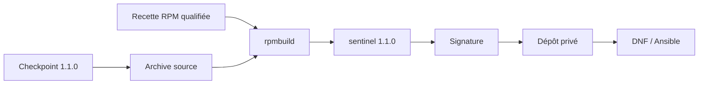

# Chapitre 14.5 — Packager avec RPM

> **Campagne 14 — Projet final**
>
> *« Un artefact qualifié doit pouvoir être identifié, vérifié, installé, mis à jour et retiré sans ambiguïté. »*

## Vous êtes ici

```text
PARTIE III — Mise en situation

Campagne 14 — Projet final

  14.1 Déployer Sentinel sur une AlmaLinux minimale ✔
  14.2 Sécuriser l'hôte ✔
  14.3 Intégrer FreeIPA ✔
  14.4 Déployer avec Ansible ✔
► 14.5 Packager avec RPM
  14.6 Conteneuriser avec Podman
  14.7 Superviser et auditer
  14.8 Audit final et tests depuis Kali
```

## Objectifs pédagogiques

À l'issue de ce chapitre, vous serez capable de :

- reconstruire le paquet Sentinel à partir du checkpoint `1.1.0` sans inventer un nouveau contrat applicatif ;
- vérifier le contenu, les dépendances, scripts et fichiers de configuration d'un RPM avant installation ;
- signer le paquet et le distribuer par un dépôt DNF de confiance ;
- migrer proprement depuis l'installation classique ;
- articuler RPM et Ansible sans double propriété des fichiers ;
- qualifier installation, mise à niveau, vérification et retour arrière.

## Pourquoi ce chapitre existe

La campagne 10 a stabilisé les interfaces de Sentinel et conçu son packaging `1.0.0`. La campagne 12 a ensuite fait évoluer l'application vers `1.1.0` pour ajouter `/metrics`. Le projet final ne réécrit pas la recette de packaging : il **reconstruit l'artefact avec le checkpoint courant** et vérifie que le cycle de vie reste valide.



## Contrat de chemins

Le paquet final conserve la convention de la campagne 10 :

| Nature | Chemin |
| --- | --- |
| code | `/usr/libexec/sentinel/` |
| configuration | `/etc/sentinel/sentinel.conf` |
| unité | `/usr/lib/systemd/system/sentinel.service` |
| état | `/var/lib/sentinel/` créé par systemd |
| journaux | stdout/stderr vers journald |

La configuration reste `%config(noreplace)`. Les clés privées et certificats propres à l'environnement ne sont pas inclus dans le paquet.

## Préparer les sources `1.1.0`

Construisez une archive à partir du checkpoint réel :

```bash
mkdir -p ~/rpmbuild/{BUILD,BUILDROOT,RPMS,SOURCES,SPECS,SRPMS}
cp -a sentinel/labs/sentinel-app/checkpoints/1.1.0 \
  /tmp/sentinel-1.1.0
```

Vérifiez qu'aucun état ou secret n'est entré dans l'arbre :

```bash
find /tmp/sentinel-1.1.0 -type f -print | sort
find /tmp/sentinel-1.1.0 \
  \( -name '*.key' -o -name '*.pem' -o -name '.env' \) -print
```

La seconde commande ne doit pas révéler de matériau privé ajouté au laboratoire.

Créez ensuite l'archive selon la méthode reproductible de la campagne 10.

## Adapter la recette sans changer son modèle

Le `Version` devient :

```spec
Version:        1.1.0
```

Le manifeste du code doit inclure le nouveau module `metrics.py` avec les autres modules Python. Les interfaces systemd et de configuration restent celles du checkpoint `1.1.0`.

Le `%check` doit au minimum couvrir :

```spec
%check
python3 -m py_compile src/*.py
python3 src/sentinel.py --version
python3 src/sentinel.py --config packaging/sentinel.conf --check-config
python3 -m unittest discover -s tests -v
```

Si la recette exécute les tests depuis un chemin différent après `%autosetup`, adaptez la commande à l'arborescence réelle du buildroot/source. Le but est que la construction échoue si le checkpoint ne passe pas ses propres tests.

## Construire sans `root`

```bash
rpmbuild -ba ~/rpmbuild/SPECS/sentinel.spec
```

Conservez les chemins produits :

```bash
find ~/rpmbuild/{RPMS,SRPMS} -type f -name '*sentinel*.rpm' -print
```

Un build réussi n'est que la première preuve.

## Inspecter l'artefact avant installation

```bash
RPM=$(find ~/rpmbuild/RPMS -name 'sentinel-1.1.0-*.rpm' | head -n1)
rpm -qpi "$RPM"
rpm -qpl "$RPM"
rpm -qpR "$RPM"
rpm -qp --scripts "$RPM"
rpm -qpc "$RPM"
```

Vérifiez en particulier :

- présence de `metrics.py` ;
- absence de `/opt/sentinel` dans le paquet final ;
- unité sous `/usr/lib/systemd/system` ;
- configuration reconnue comme fichier de configuration ;
- aucun fichier sous `/home`, `/tmp` ou un chemin de build ;
- aucun secret, état d'exécution ou clé privée.

## Signer et vérifier

Réutilisez la clé de laboratoire et la procédure de la campagne 10 :

```bash
rpmsign --addsign "$RPM"
rpm -Kv "$RPM"
rpmkeys --checksig --verbose "$RPM"
```

La clé privée de signature reste sur l'espace de publication. Les hôtes cibles reçoivent uniquement la clé publique approuvée.

## Publier dans le dépôt privé

Avant publication :

```bash
rpm -Kv "$RPM"
sudo install -m 0644 "$RPM" /srv/repo/sentinel/9/x86_64/
sudo createrepo_c --update /srv/repo/sentinel/9/x86_64
```

Si `repo_gpgcheck=1` est utilisé, régénérez la signature de `repomd.xml` après la mise à jour des métadonnées.

Le client conserve :

```ini
gpgcheck=1
repo_gpgcheck=1
sslverify=1
```

Ne désactivez aucun de ces contrôles pour contourner une erreur de publication.

## Migrer depuis l'installation classique

Avant installation du RPM :

```bash
sudo systemctl disable --now sentinel.service
sudo cp -a /etc/sentinel /root/sentinel-config-before-rpm
sudo systemctl cat sentinel.service
```

Si une unité locale existe sous `/etc/systemd/system/sentinel.service`, retirez-la **après sauvegarde et vérification**, car elle masquerait l'unité paquetée sous `/usr/lib/systemd/system`.

Installez ensuite depuis le dépôt :

```bash
sudo dnf install sentinel
rpm -q sentinel
systemctl cat sentinel.service
```

Réconciliez la configuration locale avec le modèle du paquet sans écraser les certificats ou paramètres d'environnement.

## Campagne d'acceptation du RPM

```bash
rpm -V sentinel
sudo systemctl enable --now sentinel.service
systemctl is-active sentinel.service
/usr/libexec/sentinel/sentinel --version
/usr/libexec/sentinel/sentinel \
  --config /etc/sentinel/sentinel.conf --check-config
```

Puis vérifiez les routes réellement acquises avec un client mTLS autorisé :

```text
/health
/ready
/api/v1/status
/metrics
```

La présence de `/metrics` distingue bien le paquet final `1.1.0` du jalon `1.0.0` de la campagne 10.

## Prouver la propriété des fichiers

```bash
rpm -qf /usr/libexec/sentinel/sentinel
rpm -qf /usr/libexec/sentinel/metrics.py
rpm -qf /usr/lib/systemd/system/sentinel.service
rpm -qf /etc/sentinel/sentinel.conf
```

**Interprétation :** le logiciel et son unité sont possédés par RPM. Ansible ne doit plus les copier directement s'il utilise cette stratégie.

## Scénario d'échec — altération contrôlée

Dans le laboratoire, modifiez temporairement un fichier paqueté non secret :

```bash
sudo sh -c 'printf "# probe\n" >> /usr/libexec/sentinel/version.py'
rpm -V sentinel
```

RPM doit signaler la divergence. Réparez avec l'artefact qualifié :

```bash
sudo dnf reinstall sentinel
rpm -V sentinel
```

Rejouez ensuite les tests de service.

## Scénario d'échec — signature invalide

Travaillez sur une copie du RPM, altérez-la comme dans la campagne 10 et vérifiez :

```bash
rpm -Kv /tmp/sentinel-tampered.rpm || true
```

L'artefact ne doit pas être publié ni installé. Ne résolvez jamais ce scénario par `--nogpgcheck`.

## Mise à niveau et retour arrière

Pour une révision de packaging ou version suivante qualifiée :

1. conserver l'ancien RPM et sa provenance ;
2. sauvegarder l'état et la configuration selon la politique ;
3. exécuter `dnf upgrade` depuis le dépôt approuvé ;
4. contrôler les éventuels `.rpmnew` ;
5. exécuter `rpm -V`, healthcheck, mTLS et `/metrics` ;
6. revenir au paquet précédent uniquement si la compatibilité des données le permet.

Exemple de sélection d'une version connue :

```bash
dnf --showduplicates list sentinel
sudo dnf downgrade sentinel-VERSION_PRECEDENTE
```

La version exacte doit provenir du dépôt de confiance, pas d'un fichier trouvé arbitrairement.

## Preuves à conserver

```text
04-rpm/
├── source-et-commit.txt
├── build.txt
├── contenu.txt
├── dependances.txt
├── scripts.txt
├── signature.txt
├── provenance-depot.txt
├── rpm-verify.txt
├── tests-service.txt
└── retour-arriere.md
```

## Synthèse

- le projet final reconstruit le paquet à partir du checkpoint `1.1.0` ;
- la recette de la campagne 10 est réutilisée plutôt que réinventée ;
- `metrics.py` et `/metrics` doivent être présents dans le jalon final ;
- le paquet ne contient aucun secret d'environnement ;
- RPM possède code et unité, Ansible orchestre l'état ;
- signature, dépôt et `rpm -V` fournissent des preuves complémentaires.

## Infographie de révision

```text
CHECKPOINT 1.1.0
       ↓
SOURCE + SPEC QUALIFIÉ
       ↓
RPMS BUILD + TESTS
       ↓
INSPECTION
       ↓
SIGNATURE
       ↓
DÉPÔT DNF DE CONFIANCE
       ↓
INSTALLATION → rpm -V → TESTS
```

## Navigation

[← 14.4 — Déployer avec Ansible](14.4-deployer-ansible.md) · [14.6 — Conteneuriser avec Podman →](14.6-conteneuriser-podman.md)