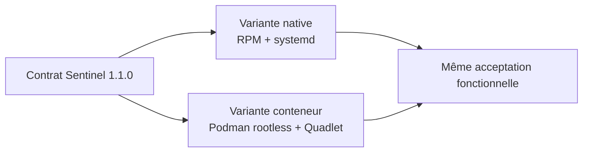
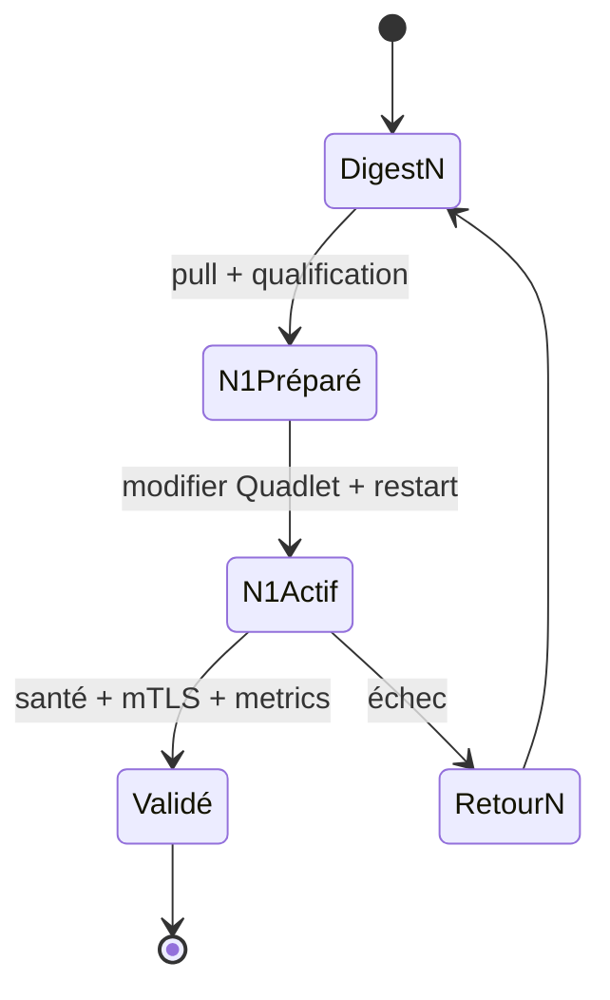

# Chapitre 14.6 — Conteneuriser avec Podman

> **Campagne 14 — Projet final**
>
> *« Une variante de déploiement est qualifiée lorsqu'elle conserve le contrat du service tout en assumant ses propres frontières. »*

## Vous êtes ici

```text
PARTIE III — Mise en situation

Campagne 14 — Projet final

  14.1 Déployer Sentinel sur une AlmaLinux minimale ✔
  14.2 Sécuriser l'hôte ✔
  14.3 Intégrer FreeIPA ✔
  14.4 Déployer avec Ansible ✔
  14.5 Packager avec RPM ✔
► 14.6 Conteneuriser avec Podman
  14.7 Superviser et auditer
  14.8 Audit final et tests depuis Kali
```

## Objectifs pédagogiques

À l'issue de ce chapitre, vous serez capable de :

- construire une image Sentinel à partir du checkpoint courant `1.1.0` ;
- expliquer pourquoi Podman est une variante d'exécution et non une couche ajoutée au service RPM actif ;
- exploiter Sentinel rootless avec Quadlet, digest, secrets et limites de ressources ;
- vérifier identité, capacités, système de fichiers, réseau, SELinux et santé ;
- démontrer que `/metrics` et le contrat mTLS restent disponibles ;
- revenir au digest qualifié précédent en cas d'échec.

## Pourquoi ce chapitre existe

La campagne 11 a construit une image à partir de Sentinel `1.0.0`. Depuis, la campagne 12 a introduit le checkpoint `1.1.0` et `/metrics`. Le projet final doit donc reconstruire la **variante conteneurisée du contrat actuel**, sans modifier le code.

Deux instances peuvent être qualifiées dans le laboratoire :



Sur un même hôte et le même port, ne démarrez pas simultanément les deux variantes. Le dossier de preuves doit indiquer laquelle est active pendant chaque test.

## Construire l'image `1.1.0`

Reprenez le `Containerfile` qualifié en campagne 11 et remplacez les sources applicatives par le checkpoint `1.1.0`. Le contexte doit contenir les modules actuels, notamment `metrics.py`, mais aucun secret.

```bash
find sentinel-image -maxdepth 2 -type f -print | sort
podman build --no-cache \
  --tag localhost/sentinel:1.1.0 sentinel-image
```

Vérifiez immédiatement :

```bash
podman run --rm localhost/sentinel:1.1.0 --version
podman image inspect localhost/sentinel:1.1.0
```

Le processus de l'image reste non privilégié, par exemple UID `10001`, et le code n'a pas besoin d'être inscriptible.

## Qualifier l'image avant promotion

```bash
podman history --no-trunc localhost/sentinel:1.1.0
podman image inspect localhost/sentinel:1.1.0
podman run --rm --entrypoint /bin/sh localhost/sentinel:1.1.0 \
  -c 'id; find /opt/sentinel -maxdepth 1 -type f -print | sort'
```

Vérifiez :

- présence des modules `1.1.0`, dont `metrics.py` ;
- absence de `.git`, `.env`, clés privées et caches de build ;
- UID applicatif non root ;
- image de base identifiée par provenance et digest ;
- aucune donnée d'état préchargée.

## Utiliser un digest qualifié

Après promotion vers le registre interne, relevez le digest :

```bash
skopeo inspect docker://registry.sentinel.lab/sentinel/sentinel:1.1.0
```

Le Quadlet final référence :

```text
registry.sentinel.lab/sentinel/sentinel@sha256:DIGEST_QUALIFIE
```

Le tag reste utile aux humains ; le digest identifie l'artefact réellement exécuté.

## Préparer le compte rootless

La campagne 11 utilise un compte dédié `sentinel-container`. Vérifiez :

```bash
id
podman info --format '{{.Host.Security.Rootless}}'
grep '^sentinel-container:' /etc/subuid /etc/subgid
loginctl show-user sentinel-container -p Linger
```

Le linger est une décision d'exploitation permettant au gestionnaire systemd utilisateur de survivre sans session interactive.

## Préparer configuration, état et secrets

Sous le compte rootless :

```bash
install -d -m 0700 ~/.config/containers/systemd
install -d -m 0750 ~/.config/sentinel
install -d -m 0750 ~/.local/share/sentinel
install -m 0644 sentinel.conf ~/.config/sentinel/sentinel.conf
```

Les certificats et clés ne sont pas ajoutés à l'image. Réutilisez les secrets Podman de la campagne 11 :

```bash
podman secret ls
podman secret inspect sentinel-tls-cert
podman secret inspect sentinel-tls-key
```

La preuve porte sur les métadonnées, jamais sur la valeur du secret.

## Déclarer le service avec Quadlet

Le fichier `~/.config/containers/systemd/sentinel.container` reprend le contrat sécurisé :

```ini
[Unit]
Description=Sentinel rootless container

[Container]
ContainerName=sentinel
Image=registry.sentinel.lab/sentinel/sentinel@sha256:DIGEST_QUALIFIE
User=10001
Group=10001
Network=sentinel.network
Volume=sentinel.volume:/var/lib/sentinel:U,Z
Volume=/home/sentinel-container/.config/sentinel/sentinel.conf:/etc/sentinel/sentinel.conf:ro,Z
Secret=sentinel-tls-cert,type=mount,target=tls.crt,uid=10001,gid=10001,mode=0444
Secret=sentinel-tls-key,type=mount,target=tls.key,uid=10001,gid=10001,mode=0400
PublishPort=127.0.0.1:8443:8443
ReadOnly=true
ReadOnlyTmpfs=true
Tmpfs=/tmp:rw,noexec,nosuid,nodev,size=16m
NoNewPrivileges=true
DropCapability=all
PidsLimit=200
Memory=256m
PodmanArgs=--cpus=1

[Service]
Restart=on-failure
RestartSec=5s
TimeoutStopSec=30s

[Install]
WantedBy=default.target
```

Vérifiez les clés avec `man podman-systemd.unit` sur la version AlmaLinux utilisée. Si une directive Quadlet n'existe pas, utilisez l'équivalent documenté plutôt que de supprimer le contrôle.

## Valider la génération

```bash
systemctl --user daemon-reload
systemctl --user list-unit-files | grep sentinel
systemctl --user cat sentinel.service
systemd-analyze --user verify sentinel.service
```

Puis :

```bash
systemctl --user enable --now sentinel.service
systemctl --user status sentinel.service --no-pager
podman ps
```

## Prouver le confinement

```bash
podman exec sentinel id
podman exec sentinel grep '^Cap' /proc/1/status
podman exec sentinel sh -c 'touch /usr/probe' || true
podman exec sentinel sh -c 'test -w /var/lib/sentinel'
podman inspect sentinel
```

**Résultat attendu :**

- processus non root selon le contrat ;
- capacités supprimées ;
- racine non inscriptible ;
- état persistant inscriptible ;
- limites de ressources visibles.

Contrôlez SELinux :

```bash
ps -eZ | grep '[s]entinel\|[c]onmon'
sudo ausearch -m AVC,USER_AVC -ts recent
```

## Vérifier le réseau

```bash
ss -lnt | grep ':8443'
podman port sentinel
```

Le port interne est publié sur `127.0.0.1` uniquement si l'architecture retient un point d'entrée externe distinct.

Depuis Kali :

```bash
nmap -Pn -p 8443 SENTINEL_IP
```

Le port ne doit pas être exposé directement. Testez ensuite le véritable point d'entrée autorisé, généralement 443.

## Vérifier le contrat `1.1.0`

Avec le client mTLS autorisé, vérifiez :

```text
GET /health        → 200
GET /ready         → 200 lorsque l'état est prêt
GET /api/v1/status → 200 lorsque l'état est lisible
GET /metrics       → métriques Prometheus
```

Les métriques doivent notamment exposer les familles réellement présentes dans le checkpoint :

```text
sentinel_build_info
sentinel_http_requests_total
sentinel_http_requests_in_flight
sentinel_http_request_duration_seconds
sentinel_dependency_up
sentinel_last_success_unixtime
```

N'ajoutez pas de métrique fictive pour faire correspondre un dashboard.

## Scénario d'échec — système de fichiers en lecture seule

```bash
podman exec sentinel sh -c 'echo fail > /opt/sentinel/probe' || true
```

L'écriture doit échouer sans rendre l'état `/var/lib/sentinel` inutilisable.

## Scénario d'échec — client non autorisé

Rejouez le cas `agent02` signé par la CA mais absent de `allowed_dns_names`.

**Résultat attendu :** la négociation TLS réussit, puis Sentinel répond `403`.

Cette preuve doit être identique conceptuellement entre variante native et variante Podman.

## Mettre à jour et revenir au digest précédent



Conservez l'ancien digest. Pour revenir :

1. remplacez le digest dans le fichier `.container` ;
2. `systemctl --user daemon-reload` ;
3. redémarrez l'unité ;
4. rejouez santé, mTLS et métriques ;
5. vérifiez la compatibilité de l'état persistant.

Un changement de format de données demanderait une stratégie distincte ; le simple retour de digest ne restaure pas les données.

## Preuves à conserver

```text
05-podman/
├── build.txt
├── image-inspect.txt
├── digest.txt
├── quadlet.txt
├── identite-capacites.txt
├── reseau.txt
├── selinux.txt
├── health-mtls-metrics.txt
└── rollback-digest.md
```

## Synthèse

- l'image finale utilise le checkpoint `1.1.0` afin de conserver `/metrics` ;
- Podman est une variante du runtime natif, pas une seconde instance superposée ;
- l'exécution reste rootless, sans capacités et avec racine en lecture seule ;
- les secrets arrivent à l'exécution, jamais pendant le build ;
- le port interne reste borné par l'architecture ;
- la promotion et le retour arrière utilisent des digests identifiables.

## Navigation

[← 14.5 — Packager avec RPM](14.5-packager-rpm.md) · [14.7 — Superviser et auditer →](14.7-superviser-auditer.md)