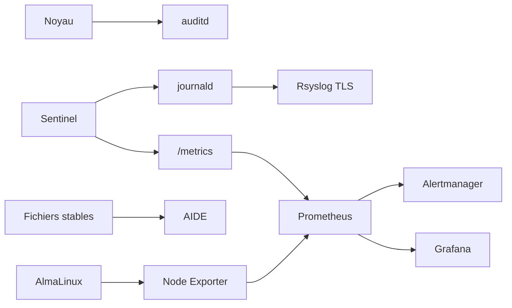
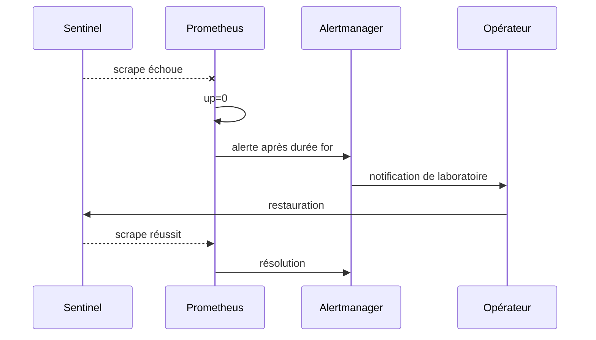

# Chapitre 14.7 — Superviser et auditer

> **Campagne 14 — Projet final**
>
> *« Une plateforme est exploitable lorsque ses pannes, ses changements et ses refus laissent assez de traces pour être compris. »*

## Vous êtes ici

```text
PARTIE III — Mise en situation

Campagne 14 — Projet final

  14.1 Déployer Sentinel sur une AlmaLinux minimale ✔
  14.2 Sécuriser l'hôte ✔
  14.3 Intégrer FreeIPA ✔
  14.4 Déployer avec Ansible ✔
  14.5 Packager avec RPM ✔
  14.6 Conteneuriser avec Podman ✔
► 14.7 Superviser et auditer
  14.8 Audit final et tests depuis Kali
```

## Objectifs pédagogiques

À l'issue de ce chapitre, vous serez capable de :

- réassembler la chaîne d'observabilité construite en campagne 12 ;
- centraliser les journaux sans prétendre qu'ils contiennent des événements jamais produits à la source ;
- vérifier les règles `auditd` et l'absence de pertes ;
- établir puis contrôler une baseline AIDE après qualification ;
- superviser Sentinel `1.1.0` avec ses métriques réellement disponibles ;
- valider règles Prometheus, alertes et dashboard avant l'audit final.

## Pourquoi ce chapitre existe

Le projet est maintenant déployable. Il reste à démontrer qu'il est **observable** : un opérateur doit savoir si Sentinel répond, si l'hôte dérive, si une configuration sensible change et si un scénario de sécurité produit les traces attendues.

La campagne 12 a déjà construit les composants. Ce chapitre ne crée pas un nouveau SIEM et n'ajoute pas de métrique applicative. Il vérifie l'assemblage existant.



## Vérifier la centralisation Rsyslog

Sur l'hôte Sentinel :

```bash
sudo rsyslogd -N1
sudo systemctl is-active rsyslog
```

Sur le collecteur :

```bash
sudo rsyslogd -N1
sudo ss -lntp | grep ':6514'
sudo systemctl is-active rsyslog
```

Produisez un événement non sensible et identifiable :

```bash
logger -t sentinel-final-audit 'probe-rsyslog-campagne-14'
```

Puis recherchez-le sur le collecteur :

```bash
sudo grep -R 'probe-rsyslog-campagne-14' /var/log/remote/ 2>/dev/null
```

**Résultat attendu :** le message apparaît sous le bon hôte et avec un horodatage cohérent.

**Interprétation :** la chaîne de transport fonctionne. Ce test ne prouve pas que toutes les sources de sécurité sont configurées ni que le stockage distant est immuable.

### Scénario d'échec — collecteur temporairement indisponible

Dans le laboratoire, interrompez brièvement la réception ou bloquez le flux selon la procédure de la campagne 12. Produisez plusieurs messages, restaurez le collecteur puis vérifiez la file et la reprise.

Documentez :

```text
heure de coupure :
messages produits :
comportement de la file :
messages reçus après reprise :
pertes constatées :
```

Ne prolongez pas volontairement la coupure jusqu'à saturer le disque.

## Qualifier Linux Audit

```bash
sudo auditctl -s
sudo auditctl -l
sudo augenrules --check
```

Le champ de pertes doit rester à zéro dans le laboratoire qualifié :

```text
lost 0
```

Les règles finales doivent couvrir les objets réellement déployés. Pour le mode natif, cela inclut typiquement :

```text
/etc/sentinel/sentinel.conf
/usr/lib/systemd/system/sentinel.service
```

Pour une variante rootless, ajoutez la source Quadlet réellement utilisée, sans surveiller tout le répertoire personnel.

### Produire une preuve d'audit

Modifiez un fichier témoin ou, dans une fenêtre contrôlée, changez puis restaurez un attribut de la configuration :

```bash
sudo touch /etc/sentinel/.audit-probe
sudo rm /etc/sentinel/.audit-probe
sudo ausearch -ts recent -k sentinel_config -i
```

La clé exacte dépend de la politique chargée. Le rapport doit permettre d'identifier l'action et l'identité de connexion pertinente.

> **Point d'expertise** — Un événement Audit est souvent composé de plusieurs enregistrements. Conservez l'événement regroupé avec `ausearch`, pas une seule ligne sortie de son contexte.

## Établir la baseline AIDE

La baseline ne doit être créée qu'après qualification du RPM ou du runtime actif.

Pour un déploiement RPM :

```bash
sudo rpm -V sentinel
sudo restorecon -RFvn /etc/sentinel /usr/libexec/sentinel
```

Puis :

```bash
sudo aide --config-check
sudo aide --init
```

Après revue, activez la base selon la procédure de la campagne 12 et conservez une empreinte protégée hors de l'hôte lorsque le laboratoire le permet.

### Périmètre recommandé

| Objet | Traitement |
| --- | --- |
| code Sentinel natif | contrôle strict |
| unité systemd ou Quadlet source | contrôle strict |
| `/etc/sentinel/` | contrôle contenu + métadonnées |
| certificats publics | contrôle contenu |
| clés privées | contrôle maîtrisé sans exposition |
| `/var/lib/sentinel/` | exclusion ou règle adaptée aux données dynamiques |
| `/run/sentinel/` | exclusion |

## Scénario d'échec — dérive détectée par AIDE

Altérez temporairement un fichier non secret déjà couvert par la baseline, puis :

```bash
sudo aide --check
```

Corrélez le rapport avec :

```bash
rpm -V sentinel 2>/dev/null || true
sudo ausearch -ts recent -k sentinel_config -i 2>/dev/null || true
```

Restaurez l'état approuvé et vérifiez de nouveau. **N'exécutez pas `aide --update` pour faire disparaître une alerte inexpliquée.**

## Vérifier les métriques Sentinel

Le checkpoint `1.1.0` expose uniquement les familles suivantes :

```text
sentinel_build_info
sentinel_http_requests_total
sentinel_http_requests_in_flight
sentinel_http_request_duration_seconds
sentinel_dependency_up
sentinel_last_success_unixtime
```

Avec le client mTLS prévu pour Prometheus, contrôlez `/metrics` sans désactiver la vérification TLS.

Sur Prometheus :

```bash
promtool check config /etc/prometheus/prometheus.yml
promtool check rules /etc/prometheus/rules/*.yml
```

Requêtes minimales :

```promql
up{job="sentinel"}
```

```promql
sentinel_build_info
```

```promql
sum by (code) (rate(sentinel_http_requests_total[5m]))
```

Le dashboard ou les alertes ne doivent pas supposer une métrique absente du checkpoint. Les signaux système supplémentaires peuvent provenir de Node Exporter ou du textfile collector et doivent être documentés comme tels.

## Vérifier Alertmanager

Validez les règles et la configuration avec les outils disponibles :

```bash
promtool test rules sentinel-alerts.test.yml
amtool check-config /etc/alertmanager/alertmanager.yml
```

Le projet doit démontrer au minimum :

- indisponibilité de la cible ;
- taux d'erreurs anormal si le trafic permet de le calculer ;
- capacité disque ou contrôle AIDE périmé selon les règles réellement conservées ;
- lien vers un runbook ou procédure d'exploitation.

Les notifications réelles peuvent être remplacées par un receiver de laboratoire. Aucun jeton de messagerie ne doit entrer dans le dépôt ou le dossier de preuves.

## Vérifier le tableau de bord

La vue Grafana finale répond au minimum aux questions :

1. Sentinel est-il joignable par Prometheus ?
2. quelle version sert actuellement ?
3. le taux d'erreurs et la latence évoluent-ils ?
4. l'hôte est-il proche d'une saturation ?
5. AIDE et Audit ont-ils des signaux anormaux ?
6. quelles alertes sont actives ?
7. où se trouve la procédure de diagnostic ?

N'affirmez pas que Grafana permet de rechercher les fichiers Rsyslog si aucun datasource de logs n'a été installé. Le projet conserve la séparation établie en campagne 12.

## Exercer une panne observable

Arrêtez Sentinel pendant une courte fenêtre de laboratoire :

```bash
sudo systemctl stop sentinel.service
```

ou, pour la variante rootless :

```bash
systemctl --user stop sentinel.service
```

Observez successivement :

```text
état systemd
échec du healthcheck
up{job="sentinel"} = 0 après scrape
alerte pending puis firing selon la règle
journaux locaux et centralisés
```

Restaurez le service et vérifiez la résolution de l'alerte.



## Dossier de preuves d'observabilité

```text
06-observabilite/
├── rsyslog-validation.txt
├── rsyslog-probe.txt
├── audit-status.txt
├── audit-events.txt
├── aide-baseline.txt
├── aide-check.txt
├── prometheus-config.txt
├── prometheus-rules.txt
├── metrics-sentinel.txt
├── alertmanager.txt
├── dashboard.md
└── panne-observable.md
```

## Critères d'acceptation avant l'audit final

- les journaux de test atteignent le collecteur ;
- `auditd` est actif, les règles utiles sont chargées et `lost=0` ;
- la baseline AIDE correspond à un état qualifié ;
- `/metrics` est collecté avec la politique TLS prévue ;
- les règles Prometheus passent leur validation ;
- Alertmanager reçoit et résout une alerte de test ;
- le dashboard affiche les métriques réellement disponibles ;
- les secrets ne sont présents dans aucune preuve.

## Retour arrière

Les composants d'observabilité ne doivent pas être retirés en bloc lors d'un incident. Pour chaque changement :

1. restaurer la dernière configuration validée ;
2. valider syntaxiquement avant reload ;
3. conserver l'ancienne baseline AIDE jusqu'à approbation de la nouvelle ;
4. restaurer les règles d'alerte depuis Git ;
5. vérifier la collecte après retour arrière ;
6. documenter toute période de visibilité réduite.

## Synthèse

- Rsyslog, Audit, AIDE et Prometheus répondent à des questions différentes ;
- une centralisation ne crée pas les événements absents de la source ;
- `auditd lost=0` et une baseline AIDE qualifiée font partie des preuves ;
- le dashboard utilise uniquement les métriques réellement exposées ;
- une panne doit produire un chemin observable de détection à résolution ;
- l'audit final peut maintenant corréler comportement externe et traces internes.

## Infographie de révision

```text
JOURNAUX ─────► RSYSLOG DISTANT
AUDIT NOYAU ──► auditd
FICHIERS ─────► AIDE
SENTINEL ─────► /metrics ─► PROMETHEUS
                               │
                               ├──► ALERTMANAGER
                               └──► GRAFANA

OBJECTIF : VOIR → CORRÉLER → EXPLIQUER → AGIR
```

## Navigation

[← 14.6 — Conteneuriser avec Podman](14.6-conteneuriser-podman.md) · [14.8 — Audit final et tests depuis Kali →](14.8-audit-final-tests-kali.md)