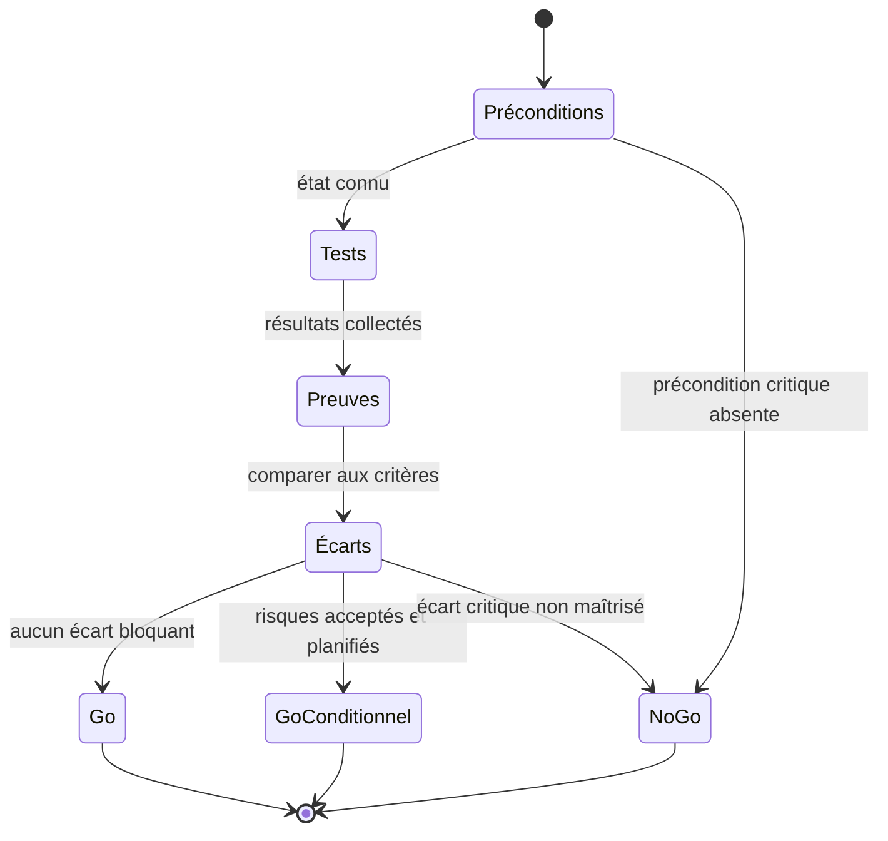
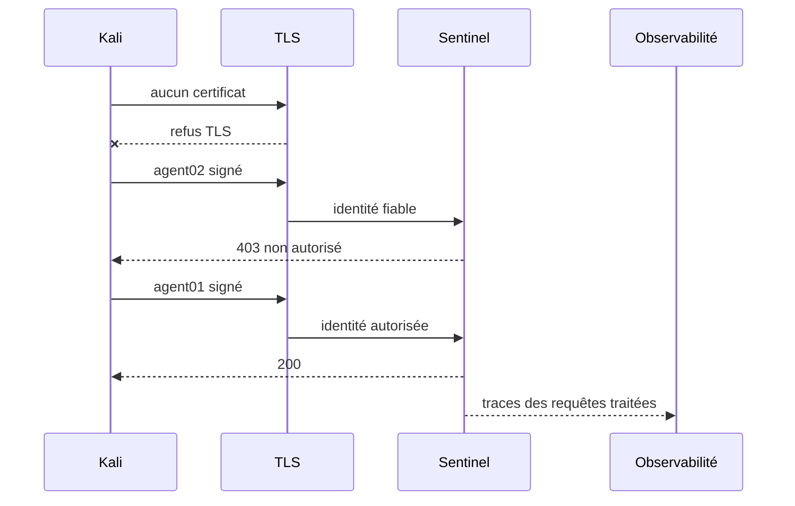

# Chapitre 14.8 — Audit final et tests depuis Kali

> **Campagne 14 — Projet final**
>
> *« L'audit final ne cherche pas un système parfait : il cherche une décision défendable, reproductible et appuyée par des preuves. »*

## Vous êtes ici

```text
PARTIE III — Mise en situation

Campagne 14 — Projet final

  14.1 Déployer Sentinel sur une AlmaLinux minimale ✔
  14.2 Sécuriser l'hôte ✔
  14.3 Intégrer FreeIPA ✔
  14.4 Déployer avec Ansible ✔
  14.5 Packager avec RPM ✔
  14.6 Conteneuriser avec Podman ✔
  14.7 Superviser et auditer ✔
► 14.8 Audit final et tests depuis Kali
```

## Objectifs pédagogiques

À l'issue de ce chapitre, vous serez capable de :

- exécuter une campagne d'acceptation reproductible depuis un état connu ;
- distinguer tests fonctionnels, contrôles de configuration et tentatives de sécurité autorisées ;
- vérifier les refus réseau, TLS, mTLS, HBAC, `sudo` et Sentinel à la bonne couche ;
- corréler les actions depuis Kali avec journaux, Audit, AIDE, métriques et alertes ;
- qualifier les écarts selon leur risque et leur caractère bloquant ;
- produire une décision finale de mise en production accompagnée d'un dossier de preuves.

## Pourquoi ce chapitre existe

Un projet de sécurité n'est pas terminé lorsque toutes les commandes ont réussi une fois. Il faut pouvoir répondre à une question plus exigeante : **un autre ingénieur peut-il reprendre le même périmètre, rejouer les tests et arriver à la même conclusion ?**

L'audit final se déroule uniquement dans le laboratoire Sentinel et sur les machines appartenant à l'apprenant. Kali sert de point d'observation externe autorisé ; il ne constitue pas une autorisation de tester un réseau tiers.

## Définir le périmètre avant de tester

Le rapport commence par un cartouche :

```text
version Sentinel : 1.1.0
commit / source :
mode natif qualifié : installation classique ou RPM
orchestration : Ansible oui/non
variante Podman qualifiée : oui/non
hôte Sentinel :
hôte FreeIPA :
hôte observabilité :
hôte Kali :
date UTC :
auditeur :
fenêtre de test :
```

Ajoutez la matrice de flux approuvée et la liste des scénarios autorisés. Tout test hors périmètre est reporté, pas improvisé.

## La chaîne de décision



La décision ne dépend pas du nombre de tests verts. Un seul écart critique — par exemple une clé privée exposée ou un accès d'administration ouvert sans contrôle — peut suffire à conclure `NO-GO`.

## Phase 0 — Geler l'état de qualification

Avant les tests :

```bash
date -u
hostnamectl
systemctl --failed
getenforce
sudo firewall-cmd --get-active-zones
sudo ss -lntup
```

Pour un déploiement RPM :

```bash
rpm -q sentinel
rpm -V sentinel
```

Pour Podman :

```bash
podman ps
podman inspect sentinel
```

Pour Ansible, conservez le commit et le dernier second passage `changed=0`.

**Critère :** aucune dérive inexpliquée ne doit être ignorée avant l'audit.

## Phase 1 — Tests fonctionnels

Avec un client mTLS autorisé, exécutez les quatre contrats HTTP existants.

```bash
curl --cacert CA.crt --cert agent01.crt --key agent01.key \
  https://sentinel.sentinel.lab/health

curl --cacert CA.crt --cert agent01.crt --key agent01.key \
  https://sentinel.sentinel.lab/ready

curl --cacert CA.crt --cert agent01.crt --key agent01.key \
  https://sentinel.sentinel.lab/api/v1/status

curl --cacert CA.crt --cert agent01.crt --key agent01.key \
  https://sentinel.sentinel.lab/metrics | head
```

Résultats attendus :

| Test | Attendu |
| --- | --- |
| `/health` | HTTP `200` et version cohérente |
| `/ready` | HTTP `200` lorsque la dépendance d'état est saine |
| `/api/v1/status` | état JSON lisible |
| `/metrics` | format Prometheus et familles `1.1.0` |

Une socket ouverte n'est pas une preuve fonctionnelle suffisante.

## Phase 2 — Surface réseau depuis Kali

Commencez par l'inventaire DNS et les ports explicitement autorisés :

```bash
dig +short sentinel.sentinel.lab A
nmap -Pn -p 22,443,8443,9100 SENTINEL_IP
```

Adaptez la liste aux ports de la matrice réelle. Le but est de vérifier quelques décisions connues, pas de lancer un scan indiscriminé.

Le rapport qualifie chaque port :

```text
port :
état observé :
état attendu :
service local correspondant :
règle Firewalld correspondante :
décision : conforme / écart
```

Exemple attendu dans une architecture où seul 443 est publié aux clients :

- 443 : accessible selon la source autorisée ;
- 8443 : non accessible directement depuis Kali ;
- 9100 : réservé à Prometheus, refusé depuis Kali ;
- 22 : selon la segmentation d'administration, refusé depuis la zone de test ou limité à un bastion.

## Phase 3 — Tests TLS et mTLS

### A. Sans certificat client

```bash
curl --cacert CA.crt https://sentinel.sentinel.lab/health
```

**Attendu :** échec de négociation lorsque mTLS est obligatoire.

### B. CA inconnue

Utilisez uniquement un certificat de laboratoire émis par une CA témoin non approuvée.

**Attendu :** échec TLS.

### C. Certificat fiable mais non autorisé

```bash
curl --cacert CA.crt --cert agent02.crt --key agent02.key \
  -o /dev/null -sS -w '%{http_code}\n' \
  https://sentinel.sentinel.lab/health
```

**Attendu :** `403`.

### D. Certificat autorisé

```bash
curl --cacert CA.crt --cert agent01.crt --key agent01.key \
  -o /dev/null -sS -w '%{http_code}\n' \
  https://sentinel.sentinel.lab/health
```

**Attendu :** `200`.



## Phase 4 — Identités d'administration

Sur le périmètre FreeIPA :

```bash
ipa hbactest --user=alice --host=sentinel.sentinel.lab --service=sshd
sudo -l -U alice
```

Puis vérifiez les opérations prévues depuis une session Alice :

```bash
sudo systemctl status sentinel.service
sudo systemctl restart sentinel.service
sudo systemctl restart sshd.service
```

**Attendu :** les opérations Sentinel définies sont autorisées, la dernière commande est refusée.

Testez aussi un utilisateur hors HBAC depuis une session de laboratoire dédiée. Le refus ne doit pas nécessiter de désactiver la voie de secours administrative.

## Phase 5 — Confinement et intégrité

### SELinux

```bash
getenforce
sudo ausearch -m AVC,USER_AVC -ts recent
```

Tout AVC inattendu est qualifié. `Permissive` ou `Disabled` constitue un écart majeur par rapport au projet.

### systemd ou Podman

Pour le service natif :

```bash
systemctl show sentinel.service \
  -p User -p NoNewPrivileges -p ProtectSystem -p CapabilityBoundingSet
```

Pour Podman :

```bash
podman exec sentinel id
podman exec sentinel grep '^Cap' /proc/1/status
podman exec sentinel sh -c 'touch /usr/probe' || true
```

### RPM

```bash
rpm -V sentinel
```

### AIDE

```bash
sudo aide --check
```

Une différence non expliquée est un écart, pas une invitation à mettre à jour la baseline.

## Phase 6 — Tentative contrôlée de modification

Modifiez un objet **témoin** couvert par Audit ou créez/supprimez un fichier de probe sous un chemin surveillé. Évitez d'altérer une clé ou un binaire de production pédagogique uniquement pour générer une trace.

```bash
sudo touch /etc/sentinel/.final-audit-probe
sudo rm /etc/sentinel/.final-audit-probe
```

Recherchez :

```bash
sudo ausearch -ts recent -k sentinel_config -i
```

Puis vérifiez que les journaux utiles ont été centralisés. Le rapport corrèle l'heure de l'action, l'identité, l'événement Audit et, lorsqu'il existe, le message applicatif ou système correspondant.

## Phase 7 — Tests d'observabilité

Sur Prometheus :

```promql
up{job="sentinel"}
```

```promql
sentinel_build_info
```

Vérifiez également les règles avec les résultats du chapitre 14.7. Provoquez une courte indisponibilité **seulement si elle est prévue dans la fenêtre d'audit**, puis observez la séquence :

```text
service arrêté
→ scrape échoue
→ up = 0
→ alerte pending
→ alerte firing après délai
→ restauration
→ alerte resolved
```

Conservez les horodatages afin de comparer métriques et journaux.

## Phase 8 — Vérification de l'automatisation

Si Ansible fait partie du mode final :

```bash
ansible-playbook playbooks/site.yml --limit sentinel_servers
```

Sur le même commit et sans changement d'entrée, le résultat doit rester :

```text
changed=0
failed=0
```

Un changement inattendu pendant l'audit est une dérive à analyser.

## Phase 9 — Vérification du paquet ou du digest

### Mode RPM

Conservez :

```bash
rpm -qi sentinel
rpm -Kv /chemin/vers/artefact-qualifie.rpm
rpm -V sentinel
dnf info --installed sentinel
```

### Variante Podman

Conservez :

```bash
podman image inspect IMAGE_QUALIFIEE
podman inspect sentinel
```

Le digest en exécution doit correspondre au digest approuvé dans la déclaration Quadlet.

## Corréler les preuves

Pour chaque scénario, remplissez une fiche :

```text
ID :
objectif :
heure UTC :
commande / action :
résultat attendu :
résultat observé :
couche concernée :
trace locale :
trace centralisée :
événement audit :
métrique / alerte :
écart : oui/non
retour en état :
```

Cette structure évite le piège du dossier constitué de captures sans relation entre elles.

## Qualifier les écarts

Utilisez une échelle simple et explicitée :

| Niveau | Exemple | Décision par défaut |
| --- | --- | --- |
| critique | secret exposé, accès admin non maîtrisé, contrôle de confiance désactivé | `NO-GO` |
| majeur | SELinux non Enforcing, mTLS contournable, absence de journalisation essentielle | correction avant production |
| modéré | alerte utile absente mais détection manuelle disponible | plan d'action daté |
| mineur | amélioration documentaire ou ergonomique | backlog |

La sévérité dépend du contexte et de l'impact réel. Justifiez chaque classement.

## Risques acceptés

Chaque risque accepté contient :

```text
risque :
actif concerné :
scénario :
impact :
probabilité estimée :
contrôles compensatoires :
propriétaire de l'acceptation :
échéance de réexamen :
```

Un risque critique ne devient pas acceptable simplement parce qu'il est écrit dans un fichier.

## Décision finale

La conclusion prend une des formes suivantes.

### `GO`

Tous les critères obligatoires sont conformes ; les écarts restants sont mineurs ou modérés, possèdent un propriétaire et ne remettent pas en cause les hypothèses de sécurité.

### `GO CONDITIONNEL`

Le service peut être mis en production uniquement avec conditions explicites : contrôle compensatoire actif, échéance courte et propriétaire identifié.

### `NO-GO`

Un contrôle critique ou majeur nécessaire au modèle de menace n'est pas démontré, ou le dossier ne permet pas de reproduire la qualification.

## Dossier final de preuves

```text
campagne-14-preuves/
├── 00-inventaire/
├── 01-hote/
├── 02-freeipa/
├── 03-ansible/
├── 04-rpm/
├── 05-podman/
├── 06-observabilite/
├── 07-audit-final/
│   ├── scope.md
│   ├── tests-fonctionnels.md
│   ├── exposition-reseau.md
│   ├── mtls.md
│   ├── identites.md
│   ├── confinement-integrite.md
│   ├── traces-correlees.md
│   ├── automatisation.md
│   ├── artefacts.md
│   └── decision-finale.md
├── incidents/
├── decisions/
└── risques-acceptes.md
```

Les preuves réelles peuvent rester dans un stockage privé lorsqu'elles contiennent des noms internes, des journaux ou des métadonnées sensibles. Le dépôt public conserve alors des modèles expurgés et les critères.

## Contrôle final avant signature

Le dossier doit permettre de répondre **oui** à chaque question :

- l'architecture et les flux sont-ils connus ?
- l'hôte est-il à jour et durci ?
- SELinux est-il `Enforcing` et Firewalld actif ?
- les accès humains passent-ils par les identités et délégations prévues ?
- les certificats sont-ils suivis et mTLS distingue-t-il confiance et autorisation ?
- le déploiement Ansible est-il idempotent lorsqu'il est utilisé ?
- le RPM est-il signé, vérifiable et possesseur des fichiers lorsqu'il est utilisé ?
- la variante Podman est-elle rootless, bornée et identifiée par digest lorsqu'elle est utilisée ?
- les journaux sont-ils centralisés ?
- Audit ne perd-il pas d'événements pendant la qualification ?
- AIDE correspond-il à une baseline approuvée ?
- Prometheus collecte-t-il les métriques réelles de `1.1.0` ?
- les alertes principales ont-elles été exercées ?
- les tests depuis Kali produisent-ils les succès et refus attendus ?
- les écarts et risques acceptés ont-ils un propriétaire ?
- le retour arrière a-t-il été documenté pour chaque mode de livraison ?

## Jalon Sentinel — plateforme qualifiée

### État de départ

Sentinel `1.1.0` possède le contrat applicatif final disponible dans le dépôt.

### Besoin

Démontrer que le produit et son infrastructure peuvent être installés, sécurisés, industrialisés, observés et audités de bout en bout.

### Modification

Le code Python reste inchangé. La campagne versionne les décisions d'architecture, les configurations, les artefacts de livraison et les preuves.

### Compatibilité

Les CLI, routes et métriques de `1.1.0` sont conservées. Les variantes native et Podman doivent présenter le même contrat fonctionnel attendu.

### Preuves

Le dossier final, la matrice d'acceptation, les refus contrôlés, les traces corrélées et la décision `GO`, `GO CONDITIONNEL` ou `NO-GO` constituent le jalon.

## Synthèse

- l'audit commence par un périmètre et un état gelé ;
- chaque test possède un résultat attendu et une trace recherchée ;
- les refus TLS, applicatifs, réseau et d'administration doivent être attribués à la bonne couche ;
- RPM, Ansible et Podman sont vérifiés selon le mode réellement utilisé ;
- un écart est qualifié et possède un propriétaire ;
- Sentinel reste en `1.1.0` : le projet final qualifie l'assemblage plutôt que d'inventer une version `2.0.0`.

## Navigation

[← 14.7 — Superviser et auditer](14.7-superviser-auditer.md) · [Sommaire de la formation](../README.md) →