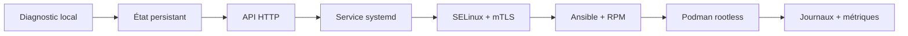
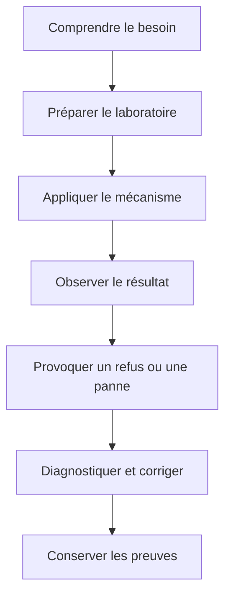

# Formation Sentinel — sécuriser et industrialiser AlmaLinux

Sentinel est une formation progressive à l'administration et à la sécurité Linux. Elle part d'une installation AlmaLinux minimale et conduit jusqu'à une plateforme exploitable : durcie, confinée, chiffrée, centralisée, automatisée, empaquetée, conteneurisée et observable.

Le même service Python, **Sentinel**, évolue tout au long du parcours. Chaque campagne introduit un besoin concret, applique les mécanismes Linux associés et exige une preuve de réussite ainsi qu'un scénario de refus ou de panne.

## Commencer la formation

Vous pouvez suivre le parcours depuis le début ou rejoindre directement un thème selon vos acquis.

| Votre objectif | Point d'entrée conseillé |
| --- | --- |
| construire un premier socle AlmaLinux | [Campagne 1 — Sécuriser le socle](campagne_01/1.1-pourquoi-securiser-socle-linux.md) |
| revoir identités, permissions et `sudo` | [Campagne 2 — Contrôler les accès](campagne_02/2.1-permissions-unix.md) |
| protéger l'exposition réseau | [Campagne 3 — TCP/IP et Firewalld](campagne_03/3.1-tcp-ip-administrateur.md) |
| sécuriser l'administration distante | [Campagne 4 — OpenSSH](campagne_04/4.1-architecture-openssh.md) |
| exploiter un service durable | [Campagne 5 — systemd](campagne_05/5.1-comprendre-systemd.md) |
| confiner un processus compromis | [Campagne 6 — SELinux](campagne_06/6.1-pourquoi-selinux-existe.md) |
| protéger et authentifier les échanges | [Campagne 7 — TLS et PKI](campagne_07/7.1-comprendre-cryptographie-appliquee.md) |
| centraliser les identités | [Campagne 8 — FreeIPA](campagne_08/8.1-presentation-freeipa.md) |
| automatiser un déploiement multi-hôte | [Campagne 9 — Ansible](campagne_09/9.1-pourquoi-automatiser-avec-ansible.md) |
| livrer un composant natif AlmaLinux | [Campagne 10 — RPM](campagne_10/10.1-construire-paquet-rpm.md) |
| exécuter Sentinel en conteneur rootless | [Campagne 11 — Podman](campagne_11/11.1-decouvrir-podman.md) |
| superviser et auditer la plateforme | [Campagne 12 — Observabilité](campagne_12/12.1-centraliser-journaux-rsyslog.md) |

Pour comprendre les interfaces déjà acquises et les versions de l'application, consultez le [parcours applicatif Sentinel](PARCOURS-SENTINEL.md).

## À qui s'adresse ce parcours ?

La formation est conçue pour un lecteur qui débute ou consolide son administration Linux. Elle ne suppose pas une expertise préalable en sécurité, mais demande de savoir utiliser un terminal, éditer un fichier texte et travailler dans une machine virtuelle.

Les notions de culture technique ne sont pas écartées lorsqu'elles aident à comprendre le système. Chaque chapitre distingue toutefois :

- le concept à retenir ;
- la commande exécutée ;
- le résultat attendu ;
- l'interprétation de ce résultat ;
- le piège ou l'échec qu'il faut savoir reconnaître.

## Le fil rouge Sentinel

Sentinel est un petit service de supervision pédagogique. Sa fonction métier reste volontairement simple afin que l'attention porte sur son intégration au système.

Les checkpoints exécutables sont conservés dans le [répertoire `labs/sentinel-app/checkpoints/` du dépôt](https://github.com/tdelaclos/formations/tree/main/sentinel/labs/sentinel-app/checkpoints). Ils permettent de reprendre le parcours à un jalon connu, de comparer deux versions et d'exécuter les tests cumulatifs.

| Version | Campagne | Évolution principale |
| --- | --- | --- |
| `0.1.0` | 1 | diagnostic local et interface CLI |
| `0.2.0` | 2 | configuration validée et état persistant |
| `0.3.0` | 3 | service HTTP et routes de santé |
| `0.4.0` | 5 | cycle de vie systemd et disponibilité |
| `0.5.0` | 7 | TLS et authentification mutuelle |
| `0.6.0` | 8 | autorisation d'identités issues de FreeIPA |
| `1.0.0` | 10 | interfaces stabilisées et paquet RPM |
| `1.1.0` | 12 | métriques Prometheus et information de build |

## Comment travailler un chapitre

Un chapitre est plus utile lorsqu'il est pratiqué sur une machine jetable et reproductible.

Pour chaque campagne :

1. lisez les chapitres dans l'ordre ;
2. exécutez les commandes dans une VM de laboratoire, pas sur un serveur important ;
3. remplacez les adresses et noms documentaires par ceux de votre environnement ;
4. comparez le résultat réel au résultat attendu ;
5. réalisez la mission finale sans recopier mécaniquement les chapitres ;
6. conservez configurations, journaux et commandes de validation.

> **Attention** — Les valeurs, identités, certificats et secrets présents dans les exemples sont pédagogiques. Ils ne doivent pas être réutilisés dans un environnement réel.

## Organisation du parcours

### Partie I — Construire un socle sécurisé

Les campagnes 1 à 7 couvrent le système minimal, les permissions, le réseau, SSH, systemd, SELinux et TLS. À la fin de cette partie, Sentinel fonctionne comme un service local confiné dont les échanges peuvent être authentifiés mutuellement.

### Partie II — Industrialiser la sécurité

Les campagnes 8 à 12 ajoutent FreeIPA, Ansible, RPM, Podman et l'observabilité. L'objectif n'est plus seulement de sécuriser une machine, mais de rendre la plateforme reproductible, maintenable et vérifiable.

### Partie III — Mettre en situation

Les campagnes 13 et 14 sont prévues pour confronter la plateforme à des scénarios d'attaque puis réaliser un projet d'intégration final. Elles apparaîtront dans la navigation lorsqu'elles seront rédigées.

## Repères utiles

- [guide de rédaction](GUIDE-REDACTION.md) ;
- [parcours applicatif et contrats de Sentinel](PARCOURS-SENTINEL.md) ;
- [sommaire GitHub et instructions d'utilisation](https://github.com/tdelaclos/formations/blob/main/README.md) ;
- [implémentations de référence et tests](https://github.com/tdelaclos/formations/tree/main/sentinel/labs/sentinel-app).

Commencez par le [chapitre 1.1 — Pourquoi sécuriser un socle Linux ?](campagne_01/1.1-pourquoi-securiser-socle-linux.md), ou choisissez dans la navigation la campagne qui correspond à votre objectif actuel.
